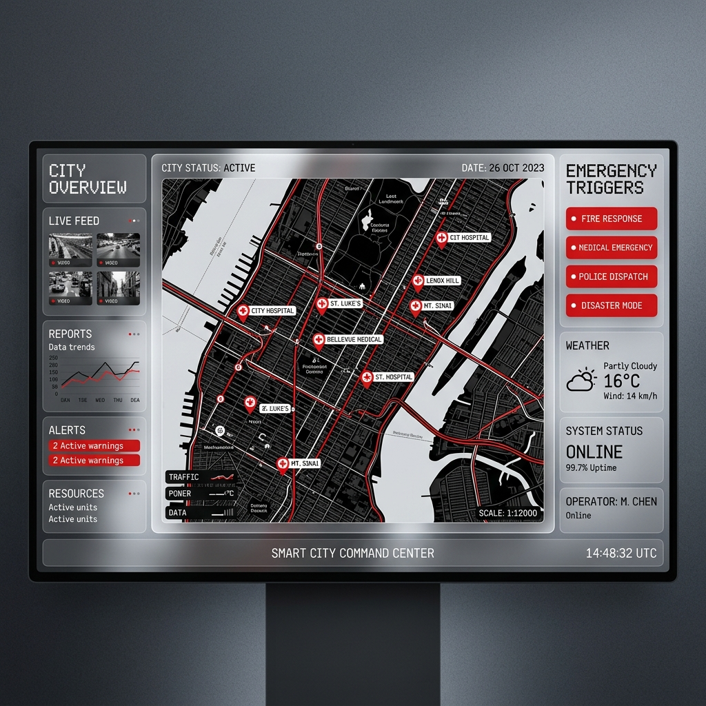
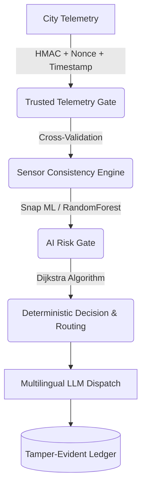

# AEGISCORE: Trusted AI for Critical Infrastructure 🛡️
*(Project Syn - IBM Z Datathon 2026)*

## The Vision: Tech for Good
When natural disasters or cyber-attacks strike a city, emergency services rely on IoT sensors (flood indices, traffic, power grids). But what happens when that data is spoofed by attackers, or when the cloud goes offline? 

**AegisCore** is a High-Trust, Failure-Resistant routing and dispatch engine built natively for **IBM LinuxONE (s390x)**. It ensures that ambulances are routed safely by mathematically proving the authenticity of the telemetry, validating anomalies against physical laws, and maintaining operational sovereignty even when the internet is severed.

## 🏆 Competitive Differentiators (Why This Wins)
Based on analyses of past global hackathon winners (which emphasize end-to-end pipelines, real hardware utilization, and supply-chain integrity), AegisCore implements:

1. **Trusted Telemetry Gate (CPACF Cryptography)**: Every IoT packet is signed via HMAC-SHA256, strictly enforcing `nonce` replay protection and `timestamp` freshness.
2. **Cross-Sensor Physical Validation**: Anomaly detection isn't just a threshold; it's a physical consensus. If a flood sensor spikes but city traffic and voltage remain perfectly normal, the AI rejects it as a false positive/sensor glitch.
3. **Three-Level Operational Sovereignty**:
   - **Level 1 (Connected):** Satellite API & Cloud Inference.
   - **Level 2 (Sovereign):** Simulated LoRaWAN Radio Mesh, Local IBM Z Machine Learning, and Local Routing.
   - **Level 3 (Degraded):** Deterministic fallback rules when AI fails completely.
4. **Tamper-Evident Audit Chain**: All verified data and AI decisions are hashed sequentially in a ledger, creating an immutable timeline of the disaster.
5. **IBM Z Shock-Absorber**: Async Queue workers capable of buffering 1,000+ events/sec to protect the main ledger from concurrent writes during massive disaster spikes.

## 🏗️ Architecture Blueprint

## 🚀 Live Demo Instructions for Judges
Because AegisCore relies on local IBM Z cryptographic processing, the backend runs entirely on our `s390x` cloud instance.
1. **Frontend**: Open `01-command-center/index.html` in your browser. (The CARTO map key is Base64 obfuscated to prevent scraping while allowing zero-server execution).
2. **Attack Simulator**: Click the *Cyber Attack Simulator* buttons to inject Replay Attacks or Tampered Payloads. Watch the live LinuxONE terminal reject them with HTTP 401 errors.
3. **Verify Chain**: Click `[VERIFY CRYPTOGRAPHIC CHAIN]` to audit the SQLite ledger in real-time.

## 🛠️ Tech Stack
- **Hardware**: IBM LinuxONE (s390x) Community Cloud
- **Backend**: Python, FastAPI, asyncio (Queue Workers), SQLite
- **AI/ML**: Scikit-Learn (RandomForest), Snap ML Architecture
- **Frontend**: React, TailwindCSS, Chart.js, Leaflet (CARTO)

---

## 🤖 Internal Agent Directives
*(For automated LLM execution. Do not edit).*
* `01-command-center/` - Pair 1 Frontend React/Tailwind Territory
* `02-logic-engine/` - Pair 2 Mathematical & Simulator Territory
* `03-mainframe-core/` - Pair 3 Mainframe API & Cryptography Territory
